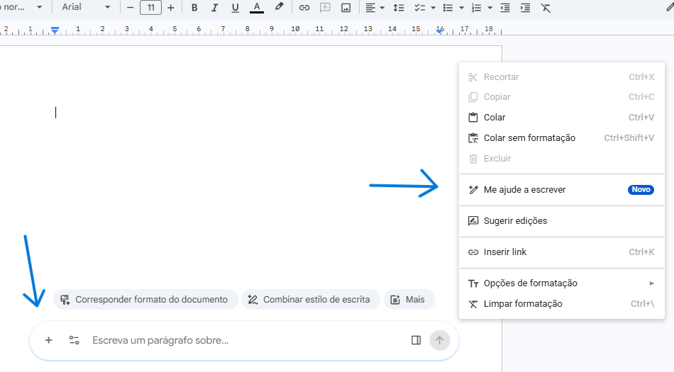
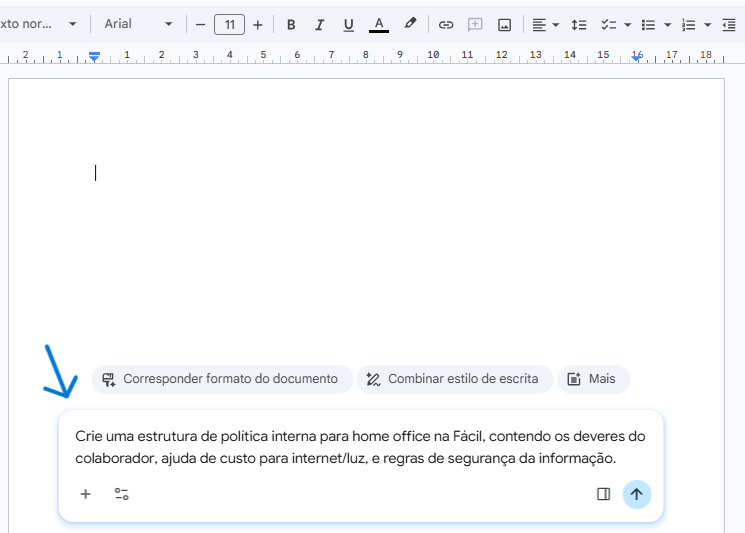
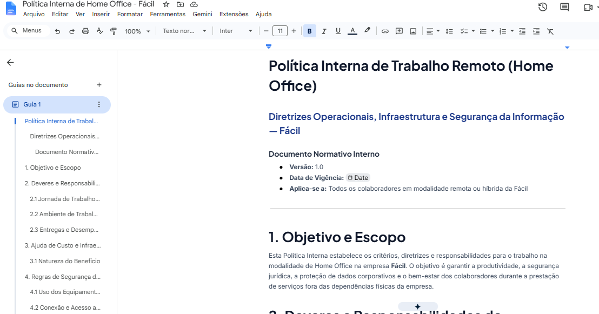
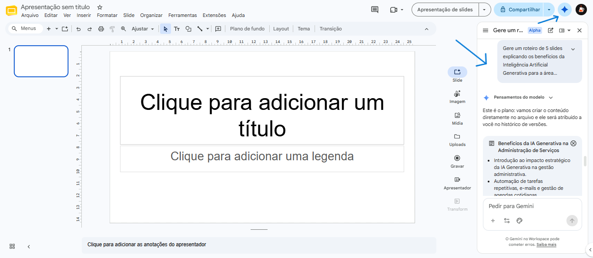
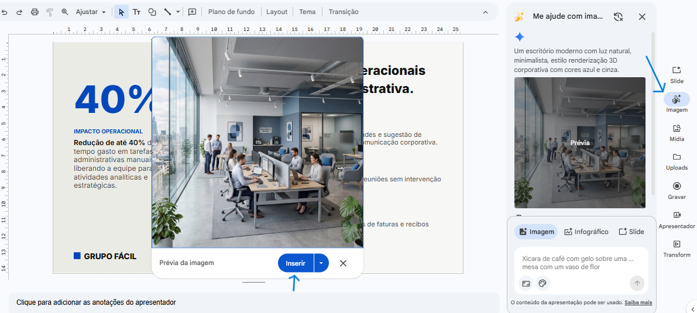
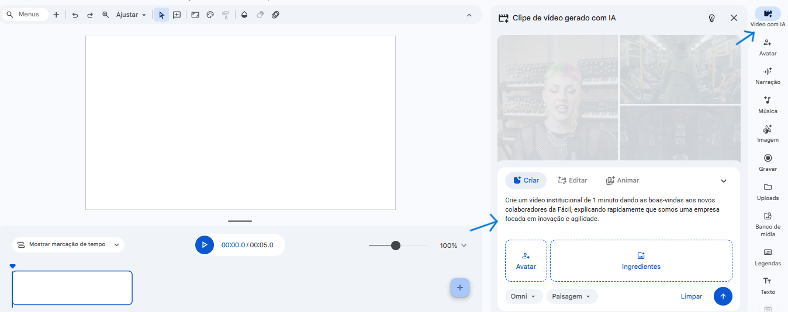
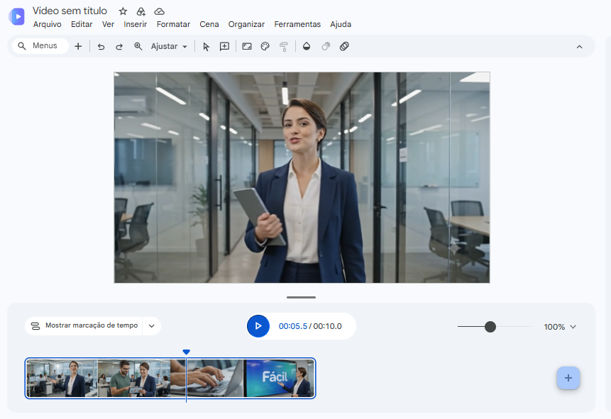

# Guia Prático de IA — Criação (Docs, Slides, Vids)

Este tutorial prático foi desenvolvido para ajudar você a dominar as ferramentas de criação assistida por Inteligência Artificial do Google Workspace na **Fácil**. Aqui você aprenderá, passo a passo, a estruturar textos e relatórios no Google Docs, criar apresentações visuais impactantes no Google Slides e roteirizar/gerar vídeos profissionais no Google Vids.

---

## Sumário

1. [1. Google Docs: Produção e Revisão de Documentos](#1-google-docs-producao-e-revisao-de-documentos)
   - [Ativando o Gemini no Docs](#ativando-o-gemini-no-docs)
   - [Escrevendo Conteúdo Estruturado](#escrevendo-conteudo-estruturado)
   - [Revisando e Formatando Textos](#revisando-e-formatando-textos)
2. [2. Google Slides: Apresentações de Alto Impacto](#2-google-slides-apresentacoes-de-alto-impacto)
   - [Gerando Roteiros para Slides](#gerando-roteiros-para-slides)
   - [Criando Imagens Originais sob Demanda](#criando-imagens-originais-sob-demanda)
3. [3. Google Vids: Roteiros e Vídeos Ágeis](#3-google-vids-roteiros-e-videos-ageis)
   - [Criando seu Primeiro Vídeo Assistido](#criando-seu-primeiro-video-assistido)
   - [Editando Storyboards e Cenas](#editando-storyboards-e-cenas)

---

## 1. Google Docs: Produção e Revisão de Documentos 

O Gemini no Docs funciona como um parceiro de escrita que ajuda você a rascunhar relatórios, criar políticas internas ou revisar o tom de documentos complexos.

### Ativando o Gemini no Docs 

1. Abra um documento em branco ou existente no Google Docs.
2. O assistente de escrita do Gemini ("Me ajude a escrever") pode ser ativado de três formas fáceis:
   - **Barra de Escrita:** Através da barra flutuante ou fixa exibida diretamente na parte inferior da página.
   - **Botão Direito:** Clicando com o botão direito do mouse em qualquer linha vazia e selecionando **"Me ajude a escrever" (Help me write)**.
   - **Balão Azul:** Clicando no ícone do balão azul redondo com estrelas brancas (ou ícone de varinha mágica) que aparece na margem esquerda ao posicionar o cursor em uma linha vazia.

*O que deve mostrar: O documento do Google Docs exibindo a barra de escrita do Gemini ("Me ajude a escrever") ou a opção de clique com botão direito ativa.*

---

### Escrevendo Conteúdo Estruturado 

1. Ative a caixa de comandos do Gemini através de um dos métodos explicados acima.
2. Escreva as diretrizes do documento que deseja criar. Exemplo:
   > *"Crie uma estrutura de política interna para home office na Fácil, contendo os deveres do colaborador, ajuda de custo para internet/luz, e regras de segurança da informação."*

*O que deve mostrar: A caixa de diálogo suspensa "Me ajude a escrever" (Help me write) aberta no Docs com o prompt acima preenchido.*

3. Clique em **Enviar** (Send) ou pressione Enter.
4. O Gemini gerará e inserirá o conteúdo estruturado com títulos, parágrafos e marcadores **diretamente no corpo do seu documento**, em tempo real.
5. Se o resultado estiver adequado, você já pode começar a trabalhar ou editar o texto diretamente. Caso precise refinar, use os botões rápidos de ajuste (como reescrever, mudar tom, encurtar ou expandir) que aparecem logo abaixo do texto gerado.

*O que deve mostrar: O documento do Google Docs com o texto estruturado gerado pelo Gemini já aplicado e formatado na página, exibindo as opções rápidas de refinamento no rodapé do bloco de texto.*

---

### Revisando e Formatando Textos 

Se você já tem um texto escrito e quer mudar o tom ou melhorar a escrita:
1. Selecione o parágrafo ou trecho desejado.
2. Clique no ícone de lápis com estrelas azul que aparece ao lado do texto selecionado.
3. Digite o que deseja fazer (ex: *"Deixe este parágrafo mais profissional"* ou *"Corrija a gramática e resuma em apenas duas frases"*).

---

## 2. Google Slides: Apresentações de Alto Impacto 

Crie a estrutura de suas apresentações e gere recursos visuais exclusivos diretamente de comandos em texto simples.

### Gerando Roteiros para Slides 

1. Abra uma nova apresentação vazia no Google Slides.
2. No menu superior ou lateral direito, clique no ícone do **Gemini** (as três estrelas brilhantes) para abrir o painel lateral.
3. No painel, digite o roteiro do que precisa. Exemplo:
   > *"Gere um roteiro de 5 slides explicando os benefícios da Inteligência Artificial Generativa para a área administrativa de uma empresa de serviços."*

*O que deve mostrar: A interface do Google Slides com os slides vazios à esquerda e o painel lateral do Gemini aberto à direita, mostrando o prompt digitado e as sugestões de estrutura de slides geradas.*

4. Clique no slide sugerido para que a IA monte a estrutura de títulos e tópicos na sua apresentação.

---

### Criando Imagens Originais sob Demanda 

Para dar uma identidade visual única aos seus slides sem depender de bancos de imagens genéricos:
1. No painel lateral do Gemini, selecione a opção **Criar imagens com Gemini** (Create images with Gemini).
2. Digite detalhadamente no prompt o que você deseja que a imagem represente. Exemplo:
   > *"Um escritório moderno com luz natural, minimalista, estilo renderização 3D corporativa com cores azul e cinza."*
3. Clique em **Criar** (Create) ou pressione Enter para que o Gemini gere a imagem correspondente.
4. Clique sobre a imagem gerada e selecione o botão **Inserir** (Insert) para adicioná-la diretamente ao seu slide ativo.

*O que deve mostrar: O painel lateral do Gemini no Google Slides exibindo o prompt de imagem digitado, a imagem gerada resultante e o botão "Inserir" ativo na interface.*

---

## 3. Google Vids: Roteiros e Vídeos Ágeis 

O Google Vids é a nova ferramenta do Workspace voltada para criação e edição de vídeos assistida por inteligência artificial para treinamentos, comunicados ou divulgações internas.

### Criando seu Primeiro Vídeo Assistido 

1. Acesse o Google Vids (via painel do Google Drive ou diretamente no link da ferramenta).
2. Clique em **Criar vídeo com o Gemini** (Help me create a video).
3. No prompt do assistente, digite a meta e o roteiro do vídeo. Exemplo:
   > *"Crie um vídeo de boas-vindas de 1 minuto para novos colaboradores de uma equipe de projetos, destacando de forma positiva a importância da colaboração e do aprendizado contínuo."*

*O que deve mostrar: A tela inicial do Google Vids mostrando a opção de iniciar uma criação com o assistente do Gemini e a caixa de prompt onde o usuário digita as metas do vídeo.*

---

### Editando Storyboards e Cenas 

1. O Gemini gerará um **storyboard** completo de cenas sugeridas, rascunhos de roteiro falado e tipos de imagens/vídeos de banco de dados sugeridos.
2. Revise a sequência de cenas. Se quiser mudar a ordem ou o conteúdo, basta arrastar as cenas ou editar o texto do roteiro diretamente.
3. Escolha uma voz de narração automatizada e a música de fundo recomendada pela IA para concluir a criação de seu vídeo.

*O que deve mostrar: O editor interno do Google Vids exibindo a linha do tempo e o storyboard gerado pela IA com miniaturas de cenas propostas, roteiro associado de cada cena e botões para escolha da trilha sonora e narração.*

---

## Ver também

- [letramento-facil.md](../letramento-facil.md) — Índice do projeto Letramento Fácil.
- [03-comunicacao.md](03-comunicacao.md) — Guia prático de IA para Comunicação (Gmail, Meet, Chat).
- [05-analise-codigo.md](05-analise-codigo.md) — Guia prático de IA para Análise, Planilhas e NotebookLM.
- [MIND.md](../../../MIND.md) — Índice geral do cérebro.
